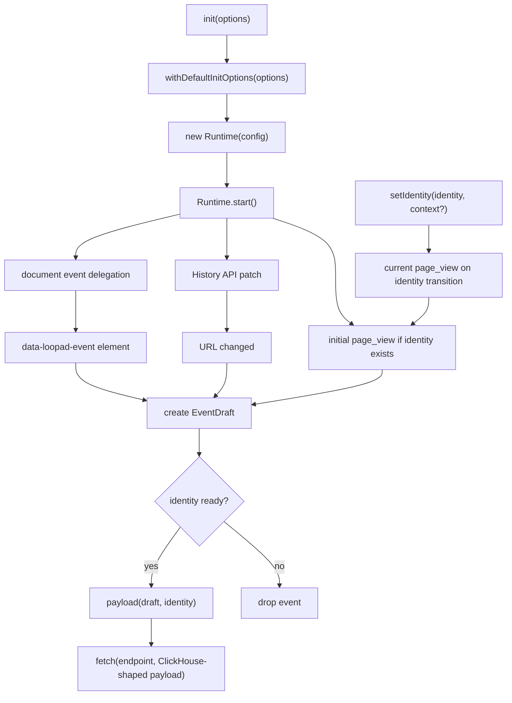

# Loop Ad Event SDK 코드 구조 튜토리얼

이 문서는 `loop-ad_event_sdk`의 실행 흐름을 빠르게 이해하기 위한 안내서입니다.
프로젝트는 MVP 원칙에 맞춰 `src/index.ts` 한 파일에 핵심 구현을 모아 둡니다.

## 전체 흐름



## 파일 배치

```text
.
├── README.md
├── docs/
│   ├── code-structure-tutorial.md
│   └── mature-sdk-patterns.md
├── examples/
│   └── basic.html
├── scripts/
│   └── build.mjs
├── src/
│   └── index.ts
├── tests/
│   └── sdk.test.mjs
├── package.json
├── tsconfig.json
└── tsconfig.build.json
```

## 공개 API

외부에 노출되는 API는 아래로 제한합니다.

```text
init(options)
client.track(eventName, fields)
client.setIdentity(identity, context?)
client.clearIdentity()
client.destroy()
```

SDK가 직접 Kafka, ClickHouse, Redis, AWS secret을 읽지 않습니다. 브라우저에서
이벤트 draft를 만들고, identity가 있으면 Event Collector ingest endpoint로 보내는
것만 담당합니다.

## Identity Gate

`userId`, `sessionId`가 없으면 이벤트를 전송하지 않습니다. 초기 `fetchMe()`나 auth
store hydration을 기다리는 동안 발생한 이벤트도 SDK가 메모리에 보관하지 않고
drop합니다.

```js
const sdk = init({ projectId: "demo-shoppingmall" });

sdk.track("product_view", { productId: "SKU-before-login" }); // dropped

sdk.setIdentity({
  userId: "user-1",
  sessionId: "session-1"
}); // current page_view is sent once

sdk.track("product_view", { productId: "SKU-after-login" }); // sent
```

로그아웃 시에는 `clearIdentity()`를 호출합니다. 다음 identity가 들어오기 전까지 새
이벤트를 drop합니다. 로그아웃 후 이벤트가 미래 로그인 사용자에게 붙는 것을 막기
위한 정책입니다.

## Payload 생성

`payload()`는 `EventDraft`와 `Identity`를 합쳐 ClickHouse `events` 테이블 컬럼명과
맞는 snake_case JSON으로 변환합니다.

예를 들어 `productId`, `campaignId`, `rewardValue`는 각각 `product_id`,
`campaign_id`, `reward_value`로 전송됩니다. 페이지 정보, SDK 버전, DOM element
정보처럼 테이블의 전용 컬럼이 없는 값은 `properties_json`에 JSON string으로
넣습니다.

## DOM 수집

DOM 자동 수집은 `data-loopad-event`가 있는 요소만 대상으로 합니다.

```html
<button
  data-loopad-event="add_to_cart"
  data-loopad-product-id="SKU-1"
  data-loopad-quantity="1"
>
  Add to cart
</button>
```

SDK는 `document`에 `click`, `change`, `submit` listener를 capture phase로 붙입니다.
개별 요소에 listener를 붙이지 않기 때문에 동적으로 추가된 요소도 수집됩니다.

input, textarea, select의 값은 자동으로 읽지 않습니다. 버튼 텍스트도 기본적으로
보내지 않으며, 꼭 필요한 경우 `data-loopad-text="true"` 또는
`data-loopad-label`을 사용합니다.

## Page View 수집

`init()` 시 identity가 이미 있으면 현재 페이지를 `page_view`로 capture합니다.
identity 없이 시작한 경우에는 첫 `setIdentity()` 호출에서 현재 페이지를 1회
기록합니다. 같은 identity 상태에서 `setIdentity()`가 반복 호출되어도 현재 페이지가
중복 기록되지는 않습니다.

SPA route 변경은 `history.pushState`, `history.replaceState`, `popstate`,
`hashchange`로 감지합니다. URL이 실제로 바뀐 경우에만 새 `page_view`를 만듭니다.
예외적으로 직접 page view가 필요하면 전용 public API 대신
`track("page_view")`를 호출합니다.

## Transport

MVP는 이벤트 하나당 HTTP 요청 하나를 보냅니다.

```js
fetch(endpoint, {
  method: "POST",
  headers: { "Content-Type": "application/json" },
  credentials: "omit",
  keepalive: true,
  body: JSON.stringify(payload)
});
```

batch, retry, localStorage queue, sendBeacon fallback은 아직 넣지 않았습니다. Event
Collector 계약이 안정되면 transport를 별도 파일로 분리할 수 있습니다.
