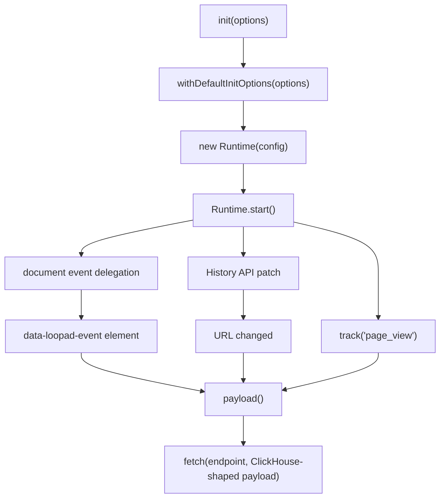

# Loop Ad Event SDK 코드 구조 튜토리얼

이 문서는 `loop-ad_event_sdk`의 실행 흐름을 빠르게 이해하기 위한 안내서입니다.
프로젝트는 참고 SDK처럼 작게 유지하며, 핵심 구현은 `src/index.ts` 한 파일에
모아 둡니다.

## 전체 흐름



## 파일 배치

```text
.
├── README.md
├── docs/
│   └── code-structure-tutorial.md
├── examples/
│   └── basic.html
├── scripts/
│   └── build.mjs
├── src/
│   └── index.ts
├── tests/
│   └── sdk.test.mjs
├── package.json
├── tsconfig.json
└── tsconfig.build.json
```

## 공개 API

외부에 노출되는 API는 아래로 제한합니다.

```ts
init(options)
client.track(eventName, fields)
client.pageView(fields)
client.identify(userId, context)
client.setContext(context)
client.destroy()
```

SDK가 직접 Kafka, ClickHouse, Redis, AWS secret을 읽지 않습니다. 브라우저에서
이벤트를 만들고 Event Collector ingest endpoint로 보내는 것만 담당합니다.

## Payload 생성

`payload()`는 camelCase 입력을 ClickHouse `events` 테이블 컬럼명과 맞는
snake_case JSON으로 변환합니다.

예를 들어 `productId`, `campaignId`, `rewardValue`는 각각 `product_id`,
`campaign_id`, `reward_value`로 전송됩니다. 페이지 정보, SDK 버전, DOM element
정보처럼 테이블의 전용 컬럼이 없는 값은 `properties_json`에 JSON string으로
넣습니다.

## 세션과 사용자 식별

로그인 사용자가 있으면 `identify(userId)`를 호출합니다. 없으면 SDK가 cookie
기반 anonymous user id를 만들고 `user_id`에 넣습니다.

세션은 `sessionTimeoutMs` 동안 비활성 상태가 이어지면 새로 생성됩니다. 기본값은
30분입니다.

## DOM 수집

DOM 자동 수집은 `data-loopad-event`가 있는 요소만 대상으로 합니다.

```html
<button
  data-loopad-event="add_to_cart"
  data-loopad-product-id="SKU-1"
  data-loopad-quantity="1"
>
  Add to cart
</button>
```

input, textarea, select의 값은 자동으로 읽지 않습니다. 버튼 텍스트도 기본적으로
보내지 않으며, 꼭 필요한 경우 `data-loopad-text="true"` 또는
`data-loopad-label`을 사용합니다.
